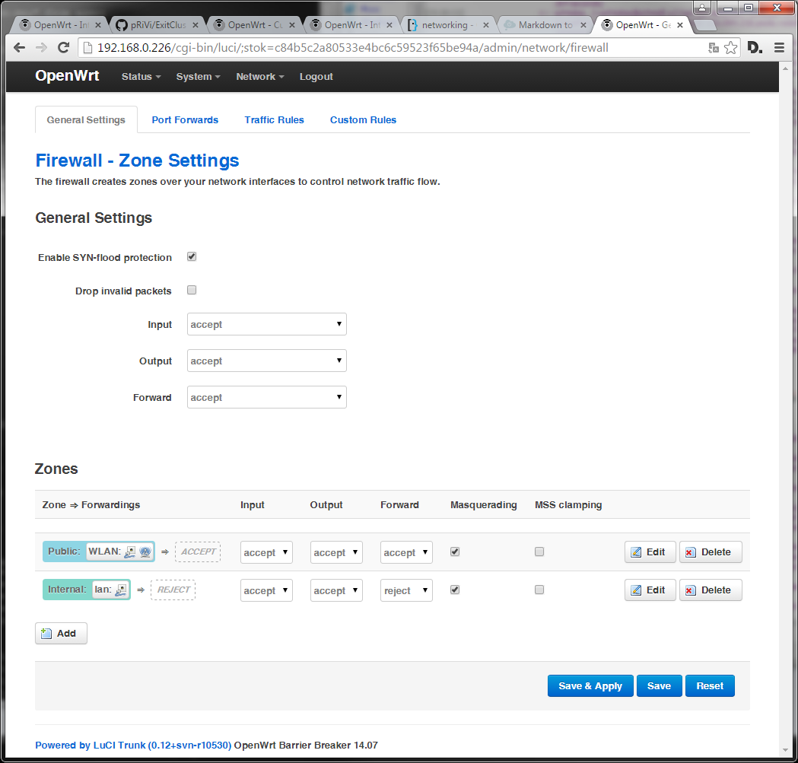
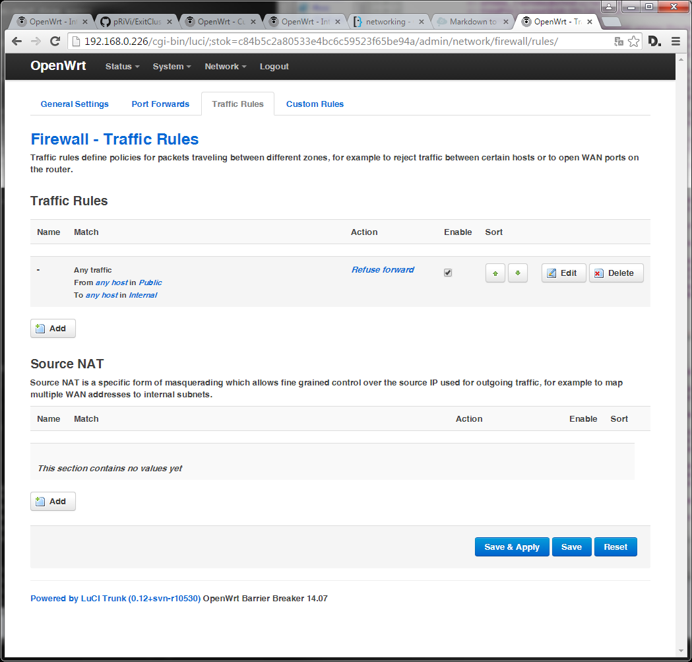
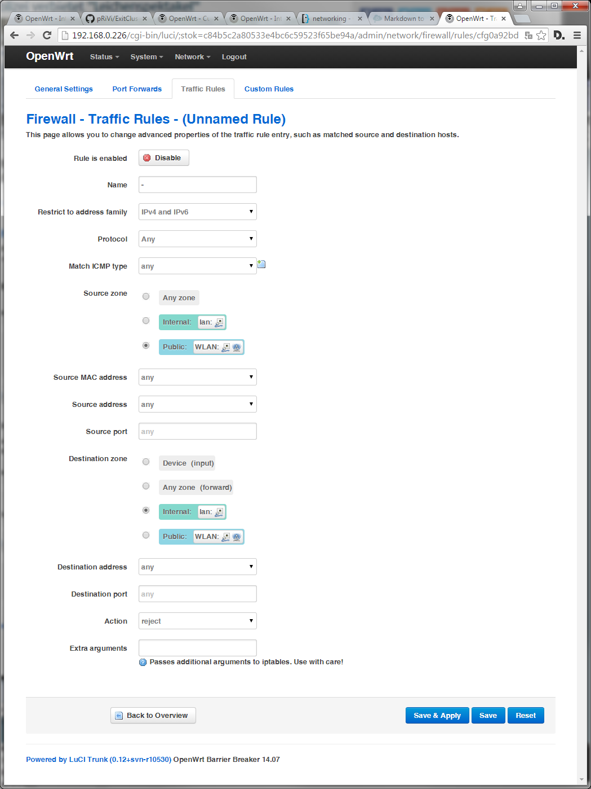
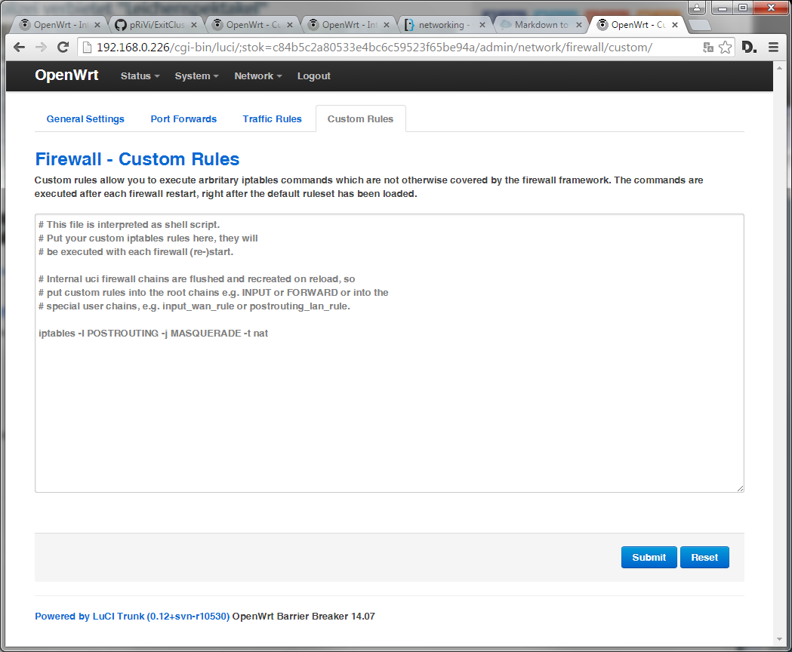

# VPN exit cluster tunnel

Currently support for debian (x86/arm) and OpenWRT.

## Get Account

Register on https://conf.priv.de/ a new certificate, and mail to freifunk2015@priv.de to get a new certificate generated and there uploaded.

## Base config

Configure your system to be able to access the internet, at best via DHCP.

The following screenshots are tested to have a working firewall config. You need to manually force NAT on the Custom Rules via:

```
iptables -I POSTROUTING -j MASQUERADE -t nat
```

The traffic rules are neccesary to protect your internal LAN against tunnel users.
  





## Install needed files

Extract all files (ResolvDns.sh, openvpnkey, ...) from the downloaded .tar.gz to /etc/openvpn/.

## Installation

### Debian

```sh
$ apt-get install openvpn dnsutils psmisc
```

You have to enable autostart in /etc/default/openvpn.

If you have a read-only rootfs, you must create a link from /etc/hosts to /tmp/hosts or make /etc/hosts writeable in any other way.

### OpenWRT

If you use OpenWRT, you have in any way enable cron the following way:

```sh
$ /etc/init.d/cron enable
```

#### With Flash >= 8 MB:

```sh
$ opkg update
$ opkg install openvpn-openssl
```

#### With Flash < 8 MB:

With 4 MB Flash you do not have enough persistent space on your device to store OpenVPN on it, so you have to download it dynamically from your local LAN or Internet to your absconding RAM. All for this has been already integrated into ResolvDns.sh if you are using OpenWRT 14.07, it should by itself download OpenVPN from the VPN server dynamically if you have not installed by yourself as described above.

If you want or must created an tar.gz of your own, so see <a href="README.nfs.md">NFS</a>. Otherwise you can use our build for 14.07 unchanged, it might run on different versions but this is completely untested.

## Install config

Copy your OpenVPN Config (vpn.priv.de.conf, client.crt, client.key and vpn.priv.de.crt) to /etc/openvpn/. Create the folder it it do not exists with 

```sh
mkdir /etc/openvpn
```

## Configure system

Add the following to your crontab, running:

```sh
crontab -e
```

You can find YOURTOLDVPNHOSTNAME in your vpn.priv.de.conf file in the first line.

```
* * * * * /bin/sh /bin/ResolvDns.sh YOURTOLDVPNHOSTNAME
```

## Reboot & Enjoy.

